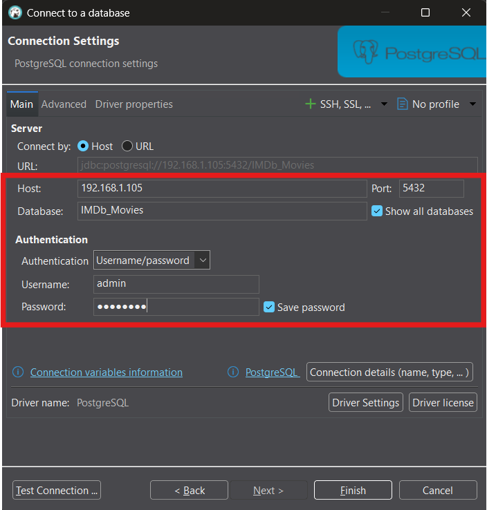
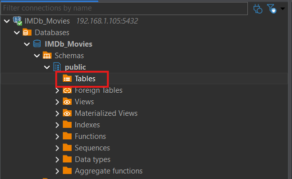
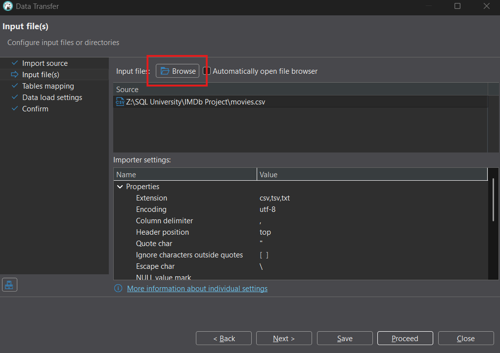
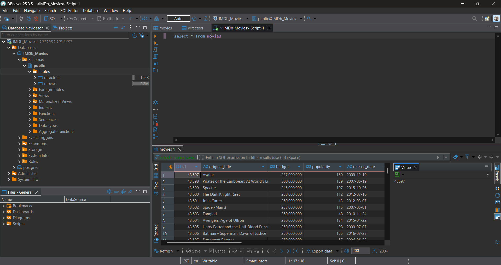

# How to Host Your Own Multi-user PostgreSQL Server for Free
## TLDR:
### Things you will need before starting:
 - A computer with an OS that supports Docker to host the server
 - Docker and Docker Compose V1 installed (on the server device)
 - A SQL Client on the device you want to query from (I used [DBeaver](https://dbeaver.io/download/))
If you are experienced with Docker and hosting services on your LAN just grab the docker-compose.yml and .env, replace the credentials and you'll be good to go.

## In-Depth Guide:
This guide is intended for users who want a sandboxed PostgreSQL server for experimental use with a small group of users. It is not designed for production use. It lacks automatic backups, advanced security configurations, and is only accessible via LAN, or remotely through a VPN tunnel. It is an excellent environment for anyone looking to practice SQL queries, database management, and basic PostgreSQL administration without the risks or complexity of a production server.

This configuration was tested on [Ubuntu Server](https://ubuntu.com/download/server) and should work on any device that supports [Docker](https://docs.docker.com/) and Docker Compose V1 - that being said, minor details may differ across operating systems

[DBeaver](https://dbeaver.io/download/) - an open source and feature rich SQL client, is used to access the server, but any SQL client can be used. Before following the tutorial, Docker and Docker Compose V1 must be installed.

I used a [sample database from Kaggle](https://www.kaggle.com/datasets/luizpaulodeoliveira/imdb-project-sql) to demonstrate importing a csv in DBeaver - if you choose to follow along with this database I have included [movies.csv](./movies.csv) and [directors.csv](./directors.csv) in the repo which I extracted from the .sqlite file that's on Kaggle.


# Configuring and Activating the PostgreSQL Container
## Create the container directory
I prefer to have a designated docker root directory, but you can choose any location you'd like.
```bash
mkdir /docker/postgresql
```

## Create the docker-compose file
```bash
nano docker-compose.yml
```
 - ctrl+V to paste
 - ctrl+O to save
 - ctrl+X to exit

### [Contents of docker-compose.yml](./docker-compose.yml):
```yaml
version: "3.9"

services:
  postgres:
    image: postgres:16 # Use the official PostgreSQL image with version 16
    container_name: postgres_server
    env_file: # Point to the .env file that has admin username, password, and database name
      - .env
    restart: unless-stopped # Restart the container unless it is explicitly stopped
    ports: # Map the PostgreSQL default port - you can change it if you want
      - "5432:5432" 
    volumes:
      - postgres_data:/var/lib/postgresql/data #If you change this path you need to define PGDATA in the .env file to match

# Define the volume for PostgreSQL data persistence
volumes:
  postgres_data:
```
## Define your environment variables
```bash
nano .env
```
### [Contents of .env](./.env.example)

```dotenv
POSTGRES_USER=admin # Replace with your desired username
POSTGRES_PASSWORD=password # Replace with your desired password
POSTGRES_DB=IMDb_Movies # Replace with your desired database name (avoid spaces, use underscores)

TZ=America/Chicago # Set the timezone to your desired value
```

## Start the Docker container
```bash
docker-compose up -d
```

## Make sure the container is running - you should see output something like this
```bash
docker ps
```
```bash
CONTAINER ID   IMAGE                                            COMMAND                  CREATED          STATUS                 PORTS                                              NAMES
1c9f9b65fa3c   postgres:16                                      "docker-entrypoint.s…"   32 seconds ago   Up 31 seconds          0.0.0.0:5432->5432/tcp, [::]:5432->5432/tcp        postgres_server
```


# Accessing the PostgreSQL Server Via DBeaver Client
First - install [DBeaver](https://dbeaver.io/download/) on the device from which you want to query your database.

## Connect to your database in DBeaver
Database -> Connect to a Database -> Select PostgreSQL


## Input the relevant credentials
 - If you do not know what to put in for "Host" you can get it by running "ip addr show" in the terminal on your server and looking for "192.168.x.x"
 - Check "show all databases" if you plan to use more than one database, this way you will not have to create a new connection for each one.
 - The username, password, and database are whatever you put in your .env file.
 - Once your connection is setup you can change the name of the connection if you want, this might be applicable if you're planning to use multiple databases.

 

# Importing your data (.csv)
## In the Database Navigator, right click tables and select "Import data."


## Select "Browse" and navigate to the csv file you want to import.


For the most part, the default settings will be fine - for the movies dataset I changed some of the data types to text because there were data points with a large number of characters. 

If you are using your own dataset you'll just need to be mindful of what data types are appropriate - the menu in the image below is found by clicking "Customize" in the "Tables mapping" section.

  

Confirm and proceed - repeat this process for any other tables you want to import (for the movies dataset we still have directors.csv).

## Once your tables are imported, go ahead and start querying!
### SQL Editor -> New SQL script


# Adding Users
To add other users to the database, utilize the SQL scripts in [createUserScripts](./createUserScripts/). These scripts allow you to create users with varying levels of permission who can access the SQL server via your LAN, or remotely using a VPN tunnel. For a more user friendly client I recommend Beekeper Studio, but you can't import a csv without upgrading to the paid version.
